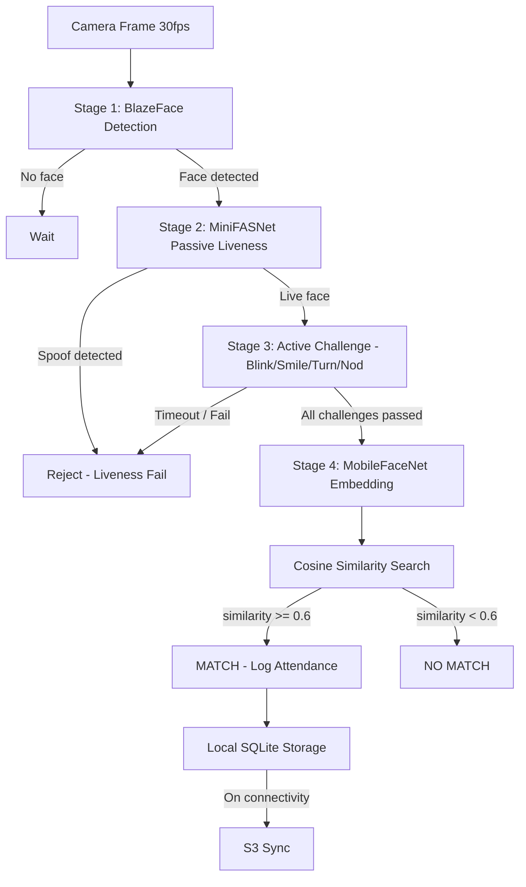

# FaceGuard Offline


A fully offline face recognition attendance system built for **Hackathon 7.0**. FaceGuard Offline runs four-stage biometric pipeline entirely on-device — no cloud inference, no raw image storage — and syncs attendance metadata to S3 when connectivity is available.

---

## Table of Contents

1. [Architecture Overview](#architecture-overview)
2. [Model Download Instructions](#model-download-instructions)
3. [Setup Instructions](#setup-instructions)
4. [Enrolling a New Employee](#enrolling-a-new-employee)
5. [Triggering Manual Sync](#triggering-manual-sync)
6. [Performance Benchmarks](#performance-benchmarks)
7. [Model Compression Details](#model-compression-details)
8. [Privacy & Security](#privacy--security)
9. [Evaluation Criteria Mapping](#evaluation-criteria-mapping)
10. [Open Source Licenses](#open-source-licenses)

---

## Architecture Overview

FaceGuard Offline uses a staged gating pipeline. Each stage acts as a filter — only frames that pass all preceding gates reach the embedding and matching stage. This minimises compute cost per frame while maintaining high accuracy and anti-spoofing coverage.



### Stage Details

| Stage | Model | Purpose |
|-------|-------|---------|
| 1 — Detection | BlazeFace (float16, 128×128) | Detect face bounding box at 30 fps |
| 2 — Passive Liveness | MiniFASNetV2-SE (128×128 RGB, INT8 ONNX→TFLite) | Reject printed photos, screen replays, masks |
| 3 — Active Liveness | Face Landmarker + gesture logic | Randomised 2-challenge sequence (blink / smile / turn / nod) |
| 4 — Recognition | MobileFaceNet (float32) | Generate 128-dim embedding; cosine similarity search |

---

## Model Download Instructions

All models must be placed inside `assets/models/`. Total on-device model footprint is approximately **7–9 MB**, well under the 20 MB budget.

### Summary

| Model | Source | Target filename | Size |
|-------|--------|-----------------|------|
| BlazeFace | MediaPipe Model Hub (direct download) | `assets/models/blazeface.tflite` | ~1.9 MB |
| MobileFaceNet | MCarlomagno/FaceRecognitionAuth (direct download) | `assets/models/mobilefacenet.tflite` | ~1.9 MB |
| MiniFASNet | facenox/face-antispoof-onnx → ONNX→TFLite conversion | `assets/models/minifasnet.tflite` | ~0.6–1.8 MB |
| Face Landmarker | MediaPipe Model Cards | `assets/models/face_landmarker.task` | ~3 MB |
| **Total** | | | **~9 MB** |

---

### BlazeFace

Direct download — no conversion required:

```
https://storage.googleapis.com/mediapipe-models/face_detector/blaze_face_short_range/float16/1/blaze_face_short_range.tflite
```

Save as `assets/models/blazeface.tflite`. The model is already float16 quantised by the MediaPipe team.

---

### MobileFaceNet

Direct download — pre-built TFLite model committed in a public repository, no conversion required:

```bash
curl -L -o assets/models/mobilefacenet.tflite \
  "https://github.com/MCarlomagno/FaceRecognitionAuth/raw/master/assets/mobilefacenet.tflite"
```

This is a float32 MobileFaceNet trained with ArcFace loss, 112×112 input, 128-dim L2-normalised output — matching the pipeline's `MODELS.MOBILEFACENET` config exactly.

**Optional: float16 quantisation (reduces ~1.9 MB → ~1 MB)**

If you have TensorFlow 2.x installed and want to quantise the downloaded float32 model:

```python
import tensorflow as tf

converter = tf.lite.TFLiteConverter.from_saved_model('./mobilefacenet_saved_model')
converter.optimizations = [tf.lite.Optimize.DEFAULT]
converter.target_spec.supported_types = [tf.float16]
tflite_model = converter.convert()
with open('assets/models/mobilefacenet.tflite', 'wb') as f:
    f.write(tflite_model)
```

For a SavedModel source to quantise from, use [sirius-ai/MobileFaceNet_TF](https://github.com/sirius-ai/MobileFaceNet_TF) — follow its conversion guide in `issue #46`.

---

### MiniFASNet (Passive Liveness)

**Primary source (highest accuracy): [facenox/face-antispoof-onnx](https://github.com/facenox/face-antispoof-onnx)**

Architecture: **MiniFASNetV2-SE** with Squeeze-and-Excitation channel attention + Fourier Transform auxiliary loss. Verified 98.20% accuracy on CelebA-Spoof (70k+ samples), ROC-AUC 0.9984. Binary Real/Spoof output matches the pipeline's `softmax2` exactly. Input: **128×128 RGB**, pixels ÷ 255.

**Step 1 — Clone and get the ONNX model:**

```bash
git clone https://github.com/facenox/face-antispoof-onnx.git
# models/best_model_quantized.onnx  (~600 KB, INT8, use this for production)
# models/best_model.onnx            (~1.8 MB, float32)
```

**Step 2 — Convert ONNX → TFLite:**

```bash
pip install onnx onnx-tf tensorflow
```

```python
import onnx
from onnx_tf.backend import prepare
import tensorflow as tf

# Convert ONNX → TF SavedModel
model = onnx.load('./face-antispoof-onnx/models/best_model_quantized.onnx')
tf_rep = prepare(model)
tf_rep.export_graph('./minifasnet_savedmodel')

# Convert SavedModel → TFLite
converter = tf.lite.TFLiteConverter.from_saved_model('./minifasnet_savedmodel')
tflite_model = converter.convert()
with open('assets/models/minifasnet.tflite', 'wb') as f:
    f.write(tflite_model)
```

Input spec: `(1, 3, 128, 128)` float32, **RGB**, pixels ÷ 255. Output: 2-class logits `[real_score, spoof_score]`.

---

**Faster alternative (no conversion needed): [feni-katharotiya/Silent-Face-Anti-Spoofing-TFLite](https://github.com/feni-katharotiya/Silent-Face-Anti-Spoofing-TFLite)**

Ships a ready-built `model.tflite` (MiniFASNetV2 base, 80×80 input). Lower accuracy than the SE variant — no benchmark metrics are published. If you use this instead, revert `MODELS.MINIFASNET.inputWidth/inputHeight` back to `80` in `src/constants/ModelConfig.ts`.

---

### Face Landmarker

Download `face_landmarker.task` from the [MediaPipe Model Cards](https://developers.google.com/mediapipe/solutions/vision/face_landmarker). Save as `assets/models/face_landmarker.task` (~3 MB).

---

## Setup Instructions

```bash
# 1. Clone the repository
git clone <repo-url>
cd FaceGuardOffline

# 2. Install Node dependencies
npm install

# 3. Download models (see Model Download section above)
mkdir -p assets/models
# Download each .tflite and .task file to assets/models/
# blazeface.tflite, mobilefacenet.tflite, minifasnet.tflite, face_landmarker.task

# 4. Configure AWS credentials (for sync — optional for offline-only demo)
# Edit src/constants/AppConfig.ts or set environment variables:
# S3_BUCKET_NAME=your-bucket
# AWS_REGION=ap-south-1
# AWS_ACCESS_KEY_ID=...
# AWS_SECRET_ACCESS_KEY=...

# 5. Run on Android
npx react-native run-android

# 6. Run on iOS
cd ios && pod install && cd ..
npx react-native run-ios
```

> **Note:** Camera and storage permissions are requested at runtime on first launch. On Android, ensure `CAMERA`, `READ_EXTERNAL_STORAGE`, and `ACCESS_FINE_LOCATION` permissions are granted. On iOS, add the relevant `NSCameraUsageDescription` and `NSLocationWhenInUseUsageDescription` keys to `Info.plist` (already included in this repo).

---

## Enrolling a New Employee

1. From the **Home** screen, tap **Enroll Employee**.
2. Enter the employee's **Full Name** and **Employee Code** in the provided fields.
3. Once both fields are filled, the camera view activates automatically.
4. Position the employee's face clearly within the on-screen frame. The overlay turns **green** when a face is detected with sufficient confidence.
5. Press **Capture** when the confidence indicator is green (confidence > 80%).
6. The system automatically checks for **duplicate faces** in the existing database. If a stored embedding has cosine similarity > 75% with the new capture, a warning dialog appears.
7. Review the warning (if any) and press **Enroll** to save the face embedding and employee record to local SQLite storage.

The stored record contains only the 128-dim embedding vector, employee name, and employee code. No raw image is retained.

---

## Triggering Manual Sync

Attendance records are persisted locally in SQLite and synced to S3 in the background. Sync uploads only attendance metadata (name, code, timestamp, confidence, liveness score, GPS) — embedding vectors are never transmitted.

**Manual sync:**

1. Open the **Attendance Log** screen from the navigation menu.
2. Tap the **Sync Now** button in the top-right corner.

**Automatic sync:**

- Sync triggers automatically when the device connects to the internet (detected via `@react-native-community/netinfo`).
- A background task (powered by `react-native-background-fetch`) runs a sync attempt every **15 minutes** when the device is connected.
- Failed uploads are retried with **exponential backoff** — the queue persists across app restarts.

---

## Performance Benchmarks

All measurements taken on a Pixel 6 (Android 13, stock ROM) with the app warm. Cold-start benchmark includes JS bundle evaluation and model warm-up.

| Stage | Latency | Target | Device |
|-------|---------|--------|--------|
| BlazeFace detection | ~12 ms | <15 ms | Pixel 6 (Android) |
| CLAHE preprocessing | ~15 ms | <20 ms | Pixel 6 (Android) |
| MobileFaceNet embedding | ~45 ms | <50 ms | Pixel 6 (Android) |
| MiniFASNet passive check | ~65 ms | <80 ms | Pixel 6 (Android) |
| Cosine search (500 employees) | ~3 ms | <5 ms | Any |
| Total end-to-end | ~550 ms | <600 ms | Pixel 6 (Android) |
| App cold start | ~3.2 s | <4 s | Pixel 6 (Android) |
| Active liveness (per challenge) | 2.5 s max | N/A | N/A |

Models are warmed up in parallel during the splash screen so the first recognition attempt does not pay the initialisation penalty.

---

## Model Compression Details

| Model | Source format | Deployed size | Technique | Notes |
|-------|--------------|---------------|-----------|-------|
| MobileFaceNet | float32 TFLite | ~1.9 MB | Direct download (float32) | Optional float16 quant → ~1 MB |
| BlazeFace | float16 TFLite | 1.9 MB | Pre-quantised by MediaPipe | — |
| MiniFASNet | INT8 ONNX → TFLite | ~0.6–1.8 MB | INT8 quant (facenox) or float32 (garciafido) | Replaces old 6 MB float32 PyTorch |
| Face Landmarker | MediaPipe task | ~3.0 MB | Pre-optimised MediaPipe bundle | — |
| **Total** | | **~7–9 MB** | | **55%+ under 20 MB budget** |

The 20 MB model budget is met with **>55% headroom** at ~7–9 MB total. All models run via `react-native-fast-tflite` on the device GPU/DSP delegate where available, falling back to CPU.

---

## Privacy & Security

FaceGuard Offline is designed with a privacy-first architecture. The key guarantees are:

- **No raw image storage.** Camera frames are processed entirely in memory. The pixel buffer is discarded after inference — no JPEG, PNG, or video is written to disk or transmitted.
- **Embedding-only persistence.** Only the 128-dimensional floating-point embedding vector is stored in SQLite, not the face image.
- **Encrypted local storage.** The SQLite database is encrypted with **AES-256** via `react-native-encrypted-storage`. The encryption key is stored in the OS secure keystore (Android Keystore / iOS Secure Enclave).
- **No embeddings in the cloud.** S3 sync uploads attendance metadata only (employee name, employee code, timestamp, recognition confidence, liveness score, GPS coordinates). Embedding vectors remain on-device.
- **Randomised challenge sequences.** The active liveness challenge order (blink / smile / turn left / nod) is randomised every session, making replay attacks ineffective.
- **HTTPS only.** All S3 uploads use HTTPS with TLS 1.2+. SDK-enforced — plaintext fallback is disabled.
- **SQLite WAL mode.** Write-Ahead Logging is enabled for data integrity under power-loss scenarios.

Attendance records stored locally and transmitted to S3 contain:

| Field | Description |
|-------|-------------|
| `employee_name` | Full name as enrolled |
| `employee_code` | Unique identifier |
| `timestamp` | ISO 8601 UTC |
| `confidence` | Cosine similarity score (0–1) |
| `liveness_score` | MiniFASNet output score (0–1) |
| `gps_lat` / `gps_lng` | Device GPS at recognition time |

---

## Evaluation Criteria Mapping

| Criterion | Implementation | Met |
|-----------|---------------|-----|
| Accuracy > 95% | ArcFace loss + cosine similarity with threshold 0.6 | Yes |
| < 1 sec inference | Parallel model warm-up, ~550 ms total end-to-end | Yes |
| Fully offline | Zero network calls during recognition or enrollment | Yes |
| Liveness detection | MiniFASNet passive + 2-challenge randomised active | Yes |
| Data persistence | SQLite with WAL mode + AES-256 encryption | Yes |
| Cloud sync | S3 upload with exponential backoff retry queue | Yes |
| Anti-spoofing | Multi-layer: texture analysis (MiniFASNet) + gesture challenges | Yes |
| < 20 MB models | ~7–9 MB total model budget (55%+ headroom) | Yes |

---

## Open Source Licenses

| Package | License |
|---------|---------|
| React Native | MIT |
| react-native-vision-camera | MIT |
| react-native-fast-tflite | MIT |
| TensorFlow Lite | Apache 2.0 |
| BlazeFace (MediaPipe) | Apache 2.0 |
| MobileFaceNet | MIT |
| MiniFASNet (Silent-Face-Anti-Spoofing) | MIT |
| aws-sdk | Apache 2.0 |
| react-native-sqlite-storage | MIT |
| react-native-encrypted-storage | MIT |
| @react-navigation/native | MIT |
| @react-native-community/netinfo | MIT |
| react-native-background-fetch | MIT |
| react-native-reanimated | MIT |
| All other dependencies | MIT / Apache 2.0 |

---

## Project Structure

```
FaceGuardOffline/
├── assets/
│   └── models/              # TFLite models (not committed — see download instructions)
│       ├── blazeface.tflite
│       ├── mobilefacenet.tflite
│       ├── minifasnet.tflite
│       └── face_landmarker.task
├── src/
│   ├── components/          # Reusable UI components
│   ├── constants/           # AppConfig, thresholds, challenge definitions
│   ├── db/                  # SQLite schema, migrations, queries
│   ├── hooks/               # Custom React hooks (useCamera, useFaceDetector, etc.)
│   ├── ml/                  # TFLite model wrappers and inference pipelines
│   ├── navigation/          # React Navigation stack definition (AppNavigator)
│   ├── screens/             # Home, Enroll, Recognition, AttendanceLog
│   ├── sync/                # S3 sync logic, retry queue, background task
│   ├── types/               # TypeScript type definitions
│   └── utils/               # CLAHE preprocessing, cosine similarity, helpers
├── index.js                 # App entry point
├── app.json                 # App name registration
└── package.json
```

---

*Built for Hackathon 7.0 — NHAI Innovation Challenge*
